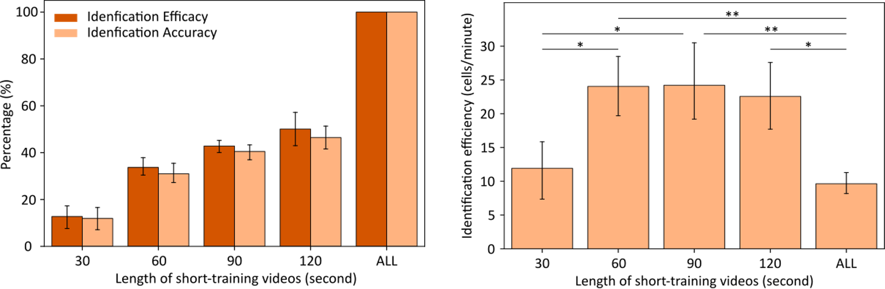
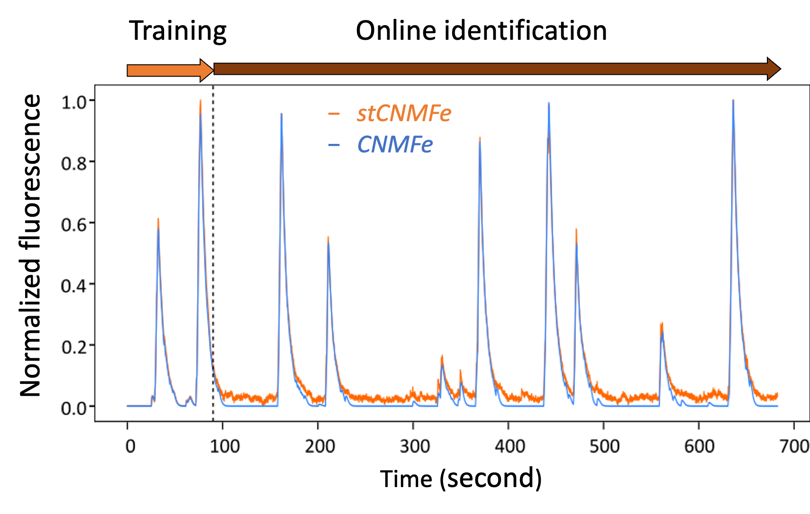

# stCNMFe

## Development of the stCNMFe algorithm
Calcium imaging has great potential to be applied to online brain-machine interfaces (BMIs). As opposed to two-photon imaging settings, a one-photon microendoscopic imaging device can be chronically implanted and is subject to little motion artifacts. Traditionally, one-photon microendoscopic calcium imaging data are processed using the **constrained nonnegative matrix factorization (CNMFe)** algorithm, but this batched processing algorithm cannot be applied in real-time. An online analysis of calcium imaging data algorithm (or OnACIDe) has been proposed, but OnACIDe updates the neural components by repeatedly performing neuron identification frame-by-frame, which may decelerate the update speed if applying to online BMIs. For BMI applications, the ability to track a stable population of neurons in real-time has a higher priority over accurately identifying all the neurons in the field of view. By leveraging the fact that 1) microendoscopic recordings are rather stable with little motion artifacts and 2) the number of neurons identified in a short training period is sufficient for potential online BMI tasks such as cursor movements, we proposed the **short-training CNMFe algorithm (stCNMFe)** that skips motion correction and neuron identification processes to enable a more efficient BMI training program in a one-photon microendoscopic setting.

## Dependency
The script is based on the [**CaImAn**](https://github.com/flatironinstitute/CaImAn) package [1]. Installation of this package is detailed in their GitHub page as well as [here](https://github.com/flatironinstitute/CaImAn/blob/main/docs/source/Installation.rst).

## Summary of traditional calcium imaging algorithms
Traditional methods for analyzing large-scale calcium imaging data include CNMFe (Constrained nonnegative matrix factorization for microendoscopic data [2]) and OnACIDe (Online Analysis of Calcium Imaging Data for microendoscopic data [3]). Their overall data-processing pipelines are similar, including **spatial filter**, **motion correction**, **source extraction**, **intensity tracking**. The main difference between CNMFe and OnACIDe is that the OnACIDe applied these steps based on real-time data, while the CNMFe performed on a pre-collected data as a whole.

## Data availability
We used data from this paper [4].

## Main results
The project is motivated by two reasons.
1. Due to the use of implanted GRIN lens, the motion artifacts are actually less concerning than two-photon imaging.
2. For the purpose of online brain-computer interface, the required number of neuron sources is less critical. It is also not required to identified all the neurons in the field of view.

Therefore, we proposed a pipeline that trains the identification of neurons based on a short snippet of neural imaging time series using the entire CNMFe process, hence the "short-training". We then track the fluorescence intensity profile of those sources throughout the rest of the training session.

We found that, for a 682 seconds imaging time series (~11 minutes), we can identify around 40% of the neurons using the first 90 seconds of data. The efficiency for identifying neurons had greatly improved due to this algorithm.

Moreover, the intensity tracks are almost identical to the one computed by CNMFe. There are artifacts due to the lack of motion correction, but they will not affect the training efficacy if the neural activity is determined by thresholding the intensity track.

## Publication
[Short-training Algorithm for Online Brain-machine Interfaces Using One-photon Microendoscopic Calcium Imaging](https://ieeexplore.ieee.org/document/9629838)
Hung-Yun Lu, Anil Bollimunta, Ryan W. Eaton, John H. Morrison, Karen A. Moxon, Jose M. Carmena, Jonathan J. Nassi, Samantha R. Santacruz. 2021 IEEE Engineering in Medicine & Biology Society (EMBC)

## Reference
[1] CaImAn an open source tool for scalable calcium imaging data analysis. Giovannucci, 2019 eLife\
[2] Efficient and accurate extraction of in vivo calcium signals from microendoscopic video data. Zhou, 2018, eLife\
[3] Online analysis of microendoscopic 1-photon calcium imaging data streams. Friedrich, 2021 Plos Computational Biology\
[4] Head-mounted microendoscopic calcium imaging in dorsal premotor cortex of behaving rhesus macaque. Bollimunta and Santacruz, 2021 Cell Reports
